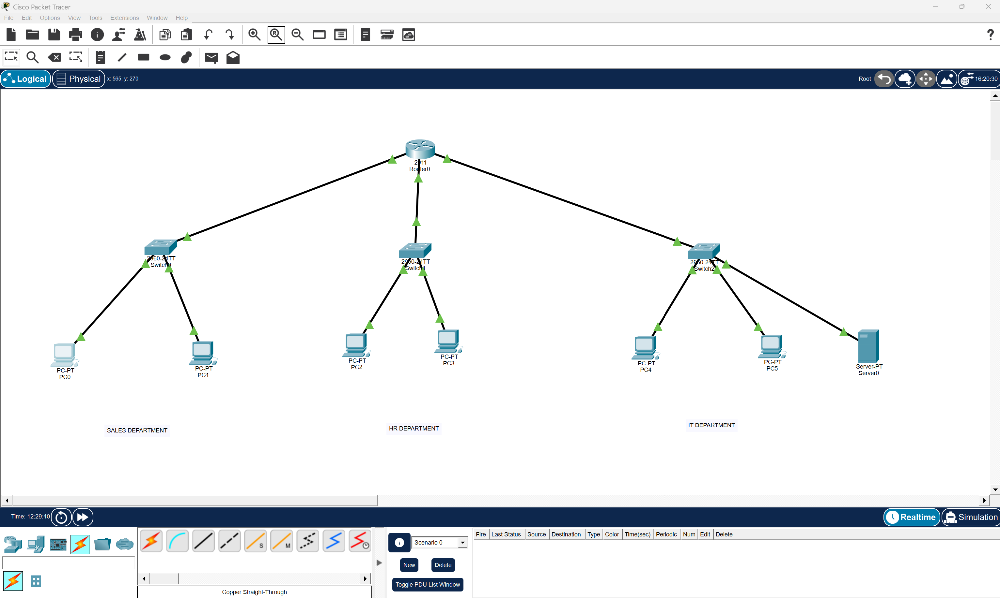
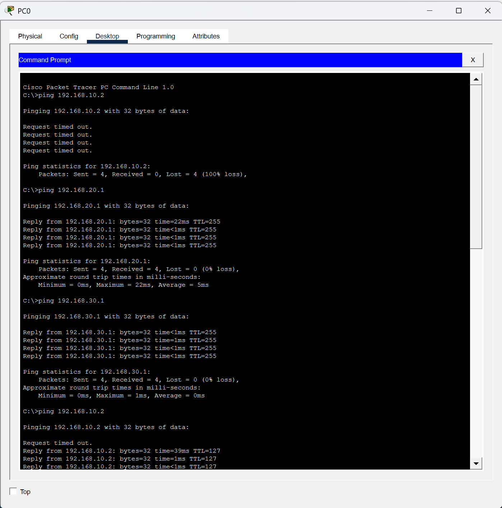
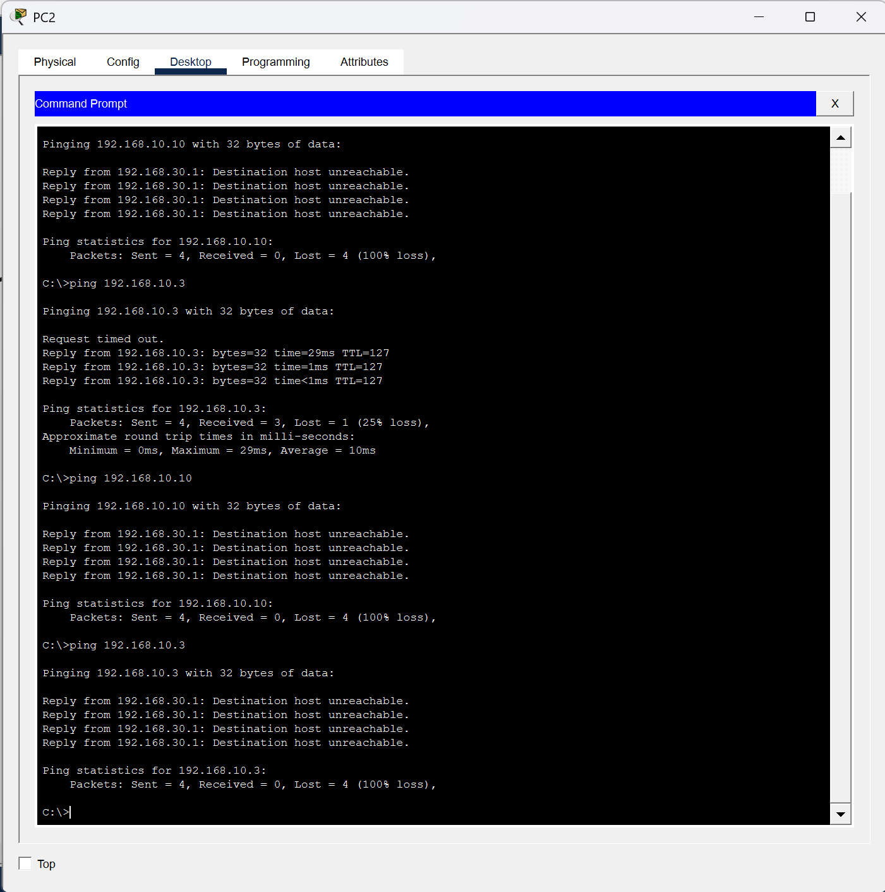

# Enterprise Network Design with Cisco Packet Tracer


## Project Overview

This project demonstrates the design and implementation of a secure enterprise network using Cisco Packet Tracer. The network consists of three departments (Sales, Human Resources, and IT), each connected through dedicated switches to a Cisco router. Static IPv4 addressing, inter-network routing, and an Extended Access Control List (ACL) were configured to enforce network security policies.

---

## Objectives

- Design a small enterprise network
- Configure router interfaces
- Configure static IPv4 addressing
- Implement inter-network routing
- Configure an Extended ACL
- Verify successful and blocked communication
- Demonstrate network troubleshooting using ping

---

## Network Topology



---

## Network Architecture

| Department | Network Address | Gateway |
|------------|----------------|----------|
| Sales | 192.168.20.0/24 | 192.168.20.1 |
| Human Resources | 192.168.30.0/24 | 192.168.30.1 |
| IT | 192.168.10.0/24 | 192.168.10.1 |

---

## Technologies Used

- Cisco Packet Tracer
- Cisco Router (2911)
- Cisco 2960 Switches
- Static IPv4 Addressing
- Extended Access Control Lists (ACLs)
- ICMP (Ping) Testing

---

## ACL Configuration

The following Extended ACL was configured to prevent the Human Resources department from accessing the IT network while allowing all other traffic.

```bash
access-list 100 deny ip 192.168.30.0 0.0.0.255 192.168.10.0 0.0.0.255
access-list 100 permit ip any any

interface GigabitEthernet0/1
 ip access-group 100 in
```

---

## Connectivity Testing

### Successful Communication

Sales devices successfully communicate with the IT network.



---

### Blocked Communication

The ACL successfully blocks Human Resources devices from accessing the IT network.



---

## Project Files

```
docs/
├── Enterprise_Network_Design_and_ACL_Implementation_Report.pdf
├── Enterprise_Network_Design_and_ACL_Implementation_Report.docx

packet-tracer/
└── Enterprise-Network.pkt

screenshots/
├── topology.png
├── sales-pc0-ip.png
├── hr-pc2-ip.png
├── it-pc4-ip.png
├── server-ip.png
├── sales-to-it-ping-1.png
├── hr-to-it-failed.png
├── acl-configuration.png
└── acl-verification.png
```

---

## Skills Demonstrated

- Enterprise Network Design
- IPv4 Addressing
- Router Configuration
- Switch Configuration
- Cisco IOS CLI
- Extended Access Control Lists
- Network Security
- Connectivity Testing
- Network Troubleshooting

---

## Future Improvements

- VLAN implementation
- DHCP configuration
- NAT and Internet connectivity
- OSPF dynamic routing
- SSH remote management
- Network monitoring

---

## Author

**Raheemah Lartey**

Cybersecurity Analyst | Data Professional

Currently building hands-on skills in:

- Cisco Networking
- SOC Operations
- SIEM
- Network Security
- Blue Team Operations

GitHub:
https://github.com/rah102993

LinkedIn:
https://linkedin.com/in/raheemah-lartey
